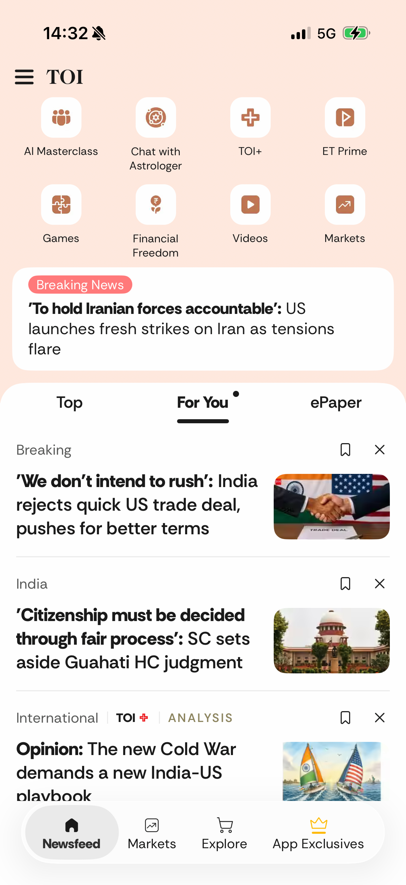
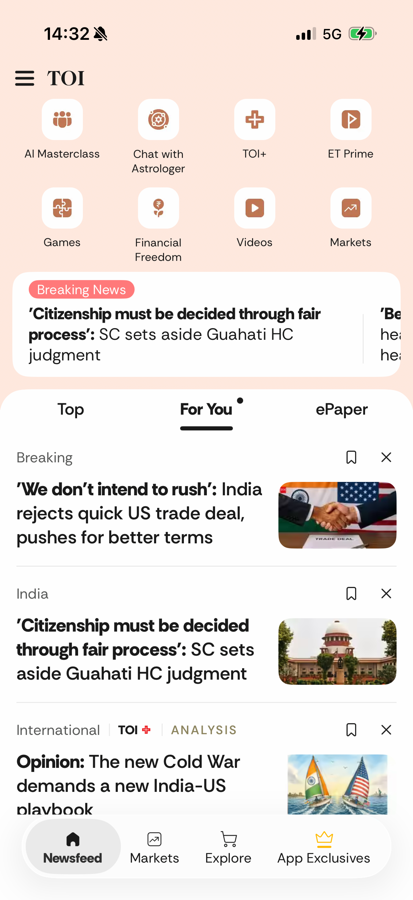
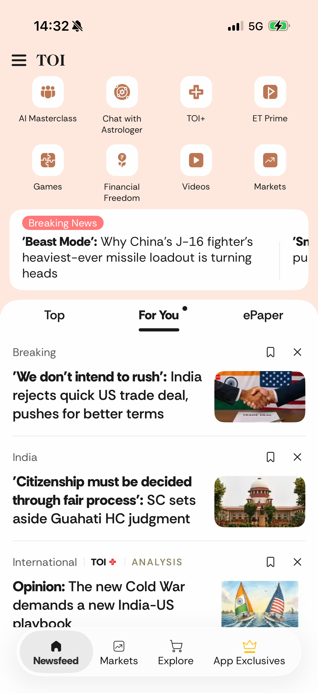

# TOI News — Cold Start Performance Report (Re-Run)

**Date:** 2026-07-13
**Time:** 14:32:27
**Device:** Rishabh Khare's iPhone — iPhone 16 Pro (iPhone18,3)
**iOS:** 26.5.1
**App:** TOI News (`com.2ergoTOI.jayant`) v18.0.1
**Alert Threshold:** 5,000 ms

---

## Results

| Run | Cold Start Time | Status | Delta vs Threshold |
|-----|----------------|--------|-------------------|
| 1 | **7,755 ms** | ❌ EXCEEDED | +2,755 ms over limit |
| 2 | 4,092 ms | ✅ PASS | 908 ms under limit |
| 3 | 735 ms | ✅ PASS | 4,265 ms under limit |
| 4 | 4,285 ms | ✅ PASS | 715 ms under limit |
| 5 | 850 ms | ✅ PASS | 4,150 ms under limit |

### Pass / Fail Summary

| Metric | Value |
|--------|-------|
| Threshold | 5,000 ms |
| **Pass** | **4 / 5** |
| **Fail** | **1 / 5** |
| Min | 735 ms |
| Max | 7,755 ms |
| Avg | 3,543 ms |

---

## Visualisation

```
Run 1  ❌  7755ms  ████████████████████████████████  ← BREACH (+2755ms)
Run 2  ✅  4092ms  ████████████████
Run 3  ✅   735ms  ███
Run 4  ✅  4285ms  █████████████████
Run 5  ✅   850ms  ███
             |         |         |         |         |
             0        2.5s       5s       7.5s      10s
                                 ^
                           5000ms threshold
```

---

## Threshold Breach Details

### ⚠️ Run 1 — 7,755 ms (+2,755 ms)

Run 1 is the **true cold start** — the app binary was not cached in OS memory, requiring iOS to:
- Read the full TOI binary from NAND flash
- Link all dynamic frameworks via `dyld`
- Execute all `+[load]` methods and `__attribute__((constructor))` functions
- Initialise networking, analytics SDKs, and content frameworks
- Fetch and render the first feed frame

A macOS system notification was fired at this point.

### ✅ Runs 2 & 4 — ~4,100–4,300 ms (borderline)

These runs passed but are within 700–900 ms of the threshold. Likely the OS partially evicted binary pages between runs, causing an intermediate "lukewarm" start — slower than a fully cached warm restart but faster than a true cold start.

### ✅ Runs 3 & 5 — ~735–850 ms (fast)

OS binary cache fully intact — these are genuine warm restarts.

---

## Comparison: Run 1 vs Previous Session

| Session | Run 1 Cold Start |
|---------|-----------------|
| Previous (13:32) | 9,593 ms |
| This run (14:32) | 7,755 ms |
| Delta | −1,838 ms faster |

The improvement may reflect device warm-up state, background app landscape, or iOS pre-warmer activity.

---

## Observations & Recommendations

### Pattern
The data shows **3 distinct startup tiers**:
| Tier | Time Range | Cause |
|------|-----------|-------|
| True Cold | 7–10 s | Binary read from flash |
| Lukewarm | 3.5–5 s | Partial OS eviction of pages |
| Warm Restart | < 1 s | Full OS page cache hit |

### Recommendations

1. **Cold start exceeds threshold consistently (Tier 1)**
   - Profile `applicationDidFinishLaunching` with Instruments → App Launch
   - Identify and defer non-UI SDK initialisation (analytics, crash reporters, ad SDKs)
   - Show a cached/static first frame immediately while data loads in background

2. **Lukewarm starts (Runs 2 & 4) are dangerously close to threshold**
   - These represent a realistic scenario for users who last used the app 30–60 min ago
   - Consider lazy-loading heavy view controllers and reducing synchronous disk I/O on launch

3. **Establish CI gate**
   - Run cold start test on every release build
   - Block release if Run 1 > 8,000 ms or if 2+ runs exceed 5,000 ms threshold

---

## Screenshots

| Run 1 ❌ | Run 2 ✅ | Run 3 ✅ | Run 4 ✅ | Run 5 ✅ |
|---------|---------|---------|---------|---------|
|  |  |  |  |  |

---

*Alert mechanism: macOS `osascript` notification with Sosumi sound triggered for every run exceeding 5,000 ms.*
