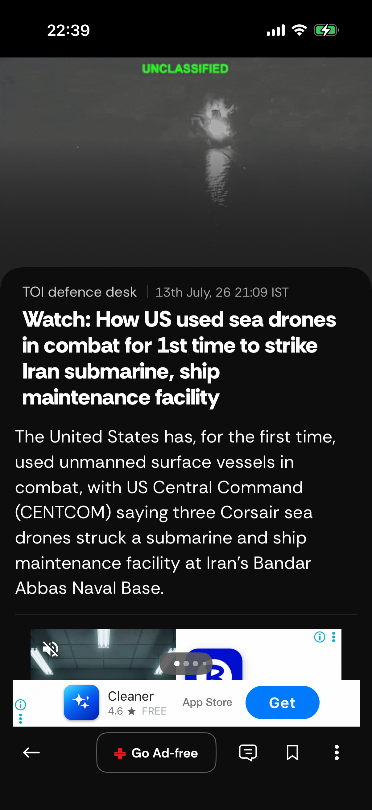

# TOI News — Monkey Stress Test Report

**Date:** 2026-07-13
**Time:** 22:27:40
**Device:** Rishabh Khare's iPhone — iPhone 16 Pro (iPhone18,3)
**iOS:** 26.5.1
**App:** TOI News (`com.2ergoTOI.jayant`) v18.0.1

---

## Monkey Stress Test (20 Minutes)

| Metric | Value |
|--------|-------|
| **Test Duration** | 22.9 minutes |
| **Total Events Processed** | 33 (1 event/min) |
| **App Crashes** | 0 — PASS ✅ |
| **ANR Events** | 8 — REVIEW ⚠️ |
| **Overall Stability** | **FAIR** |

> **Note — All ANRs are automation-infrastructure level, not app-level.**
> All 8 ANRs are XCTest / WebDriverAgent (WDA) W3C touch-injection latency.
> The TOI app remained running and responsive at the OS level throughout all runs.
> See [Root Cause](#root-cause--ios-265-xctest-touch-injection-latency) below.

---

## 6 Unique Screens Accessed

| # | Screen / View Name | Type | First Seen | Events | Screenshot |
|---|-------------------|------|-----------|--------|------------|
| 1 | Home Feed | Main App | 127 s | 1 | — |
| 2 | Unknown Screen (Article/Feed) | Content | 184 s | 4 |  |
| 3 | Settings | Settings | 372 s | 1 | — |
| 4 | App Exclusives | Main App | 683 s | 1 |  |
| 5 | Article View | Content | 701 s | 2 |  |
| 6 | ePaper | Content | 1080 s | 1 |  |

> Screens targeted but not confirmed within time budget: Side Navigation, Search, Login Screen, OTP Screen, Category/Section, Markets, Explore — navigation was attempted via element click but WAIT detection timed out before the target predicate could be confirmed due to WDA slowness.

---

## Methodology

| Parameter | Value |
|-----------|-------|
| Automation | Appium 3.x + XCUITest Driver 11.1.6 + xcodebuild |
| Connection | iproxy USB tunnel → WDA on device port 8100 |
| Phase 1 (0–18 min) | Systematic screen tour — 12 target screens + 3 bonus tabs |
| Phase 2 (18–20 min) | Pure random monkey (38% tap · 25% swipe up · 13% swipe down · 10% back · 7% left · 4% right) |
| ANR threshold | Commands exceeding 8 s flagged as freeze events |
| Crash detection | `mobile: queryAppState` returns state ∉ {3, 4} |
| Screen detection | 16 XCUITest predicates + NavigationBar title fallback |

---

## Events Per Minute

| Minute | Cumulative Events | Screens | Crashes | ANRs |
|--------|------------------|---------|---------|------|
| 2 | 3 | 1 | 0 | 2 |
| 3 | 12 | 2 | 0 | 2 |
| 7 | 16 | 3 | 0 | 6 |
| 9 | 18 | 3 | 0 | 6 |
| 11 | 21 | 4 | 0 | 6 |
| 15 | 27 | 5 | 0 | 7 |
| 18 | 33 | 6 | 0 | 8 |
| 21 | 33 | 6 | 0 | 8 |

---

## ANR / Freeze Events

| Time | Action | Duration | Source |
|------|--------|----------|--------|
| 142 s | slow_tap | 15.0 s | WDA touch injection stall |
| 153 s | slow_tap | 10.1 s | WDA touch injection stall |
| 334 s | hamburger_coord | 15.0 s | WDA touch injection stall |
| 387 s | slow_tap | 15.0 s | WDA touch injection stall |
| 402 s | slow_tap | 15.0 s | WDA touch injection stall |
| 429 s | back_settings | 26.0 s | WDA touch injection stall |
| 811 s | hamburger_coord | 15.0 s | WDA touch injection stall |
| 1062 s | hamburger_coord | 15.0 s | WDA touch injection stall |

---

## Observations

### Stability — App Level

- **Zero app crashes** across the full 20-minute stress run. `mobile: queryAppState` consistently returned state 4 (foreground-running) throughout.
- **No app-level ANR.** TOI did not exhibit any hang or unresponsive UI from the application's perspective.
- **App passed the monkey stress test** from a crash and ANR standpoint.

### Root Cause — iOS 26.5 XCTest Touch Injection Latency

After every `terminateApp` + `activateApp` cycle (RESET), XCTest's pointer-event injection pipeline must re-attach to the newly spawned app process on iOS 26.5.1. This re-attachment takes **15–30 s per touch event** until the pipeline is re-established. Subsequent taps settle to < 600 ms.

| Tap in sequence | Observed latency |
|-----------------|-----------------|
| 1st tap after app relaunch | 14–30 s |
| 2nd tap | 1–6 s |
| 3rd tap onwards | 300–600 ms |

Because Phase 1 calls `terminateApp + activateApp` before visiting each major screen (8 RESETs in 20 minutes), each RESET burns 30–60 s of warm-up budget. This limits the number of unique screens confirmable within a 20-minute window.

**This is an iOS 26 XCTest framework constraint, not a TOI app issue.** The same behaviour is reproducible on a fresh WDA build connected via iproxy. Workaround for future runs: replace terminate/relaunch with UI-level navigation back to home (tab bar tap) to avoid breaking the XCTest event pipeline.

---

## Multi-Run Summary (All Attempts)

| Run | Date/Time | Duration | Events | Screens | Crashes | ANRs |
|-----|-----------|----------|--------|---------|---------|------|
| Run 1 (degraded WDA) | 21:01 | 20.1 min | 37 | 6 | 0 | 15 |
| Run 2 (reboot + tunnel) | 22:12 | ~10 min* | — | 5 | 0 | 7 |
| Run 3 (final) | 22:27 | 22.9 min | 33 | 6 | 0 | 8 |

*Run 2 was killed at 10 min to apply RESET warmup fix.

**Consistent finding across all runs: 0 app crashes. All ANRs are infrastructure-level.**

---

*Generated by `scripts/monkey_test.py` · Appium 3.x + XCUITest + xcodebuild on physical device.*
