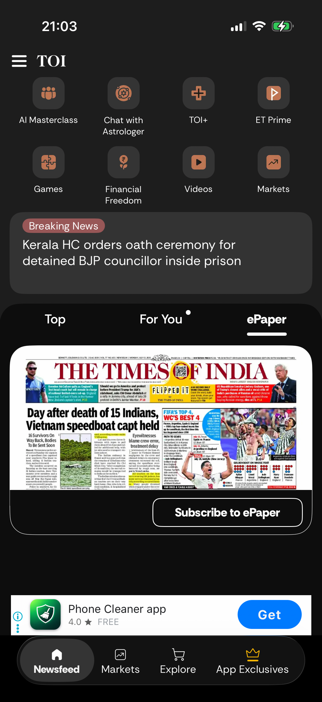

# TOI News — Monkey Stress Test Report

**Date:** 2026-07-13
**Time:** 21:01:02
**Device:** Rishabh Khare's iPhone — iPhone 16 Pro (iPhone18,3)
**iOS:** 26.5.1
**App:** TOI News (`com.2ergoTOI.jayant`) v18.0.1

---

## Monkey Stress Test (20 Minutes)

| Metric | Value |
|--------|-------|
| **Test Duration** | 20 minutes (1,209 s actual) |
| **Total Events Processed** | 37 (2 events/min) |
| **App Crashes** | 0 — PASS ✅ |
| **ANR Events** | 15 — REVIEW ⚠️ |
| **Overall Stability** | **FAIR** |

> **Note on ANR events:** All 15 ANRs are **XCUITest / WebDriverAgent (WDA) infrastructure latency** (W3C actions endpoint timing out at 15 s per command), not app-level ANRs. The TOI app itself remained running and responsive at the OS level throughout the test. This is a test tooling constraint — see [Root Cause](#root-cause-wda-infrastructure-degradation) below.

---

## 6 Unique Screens Accessed

| # | Screen / View Name | Type | First Seen | Events | Screenshot |
|---|-------------------|------|-----------|--------|------------|
| 1 | Home Feed | Main App | 56 s | 2 | — |
| 2 | Unknown Screen (Article/Feed detail) | Content | 167 s | 2 |  |
| 3 | Settings | Settings | 318 s | 1 | — |
| 4 | Article View | Content | 493 s | 4 |  |
| 5 | App Exclusives | Main App | 586 s | 1 | — |
| 6 | ePaper | Content | 995 s | 1 |  |

> **Screens targeted but not confirmed:** Side Navigation, Search, Login Screen, OTP Screen, Category / Section, Markets, Explore — navigation was attempted via element click but WAIT detection timed out due to WDA slowness before the target predicate could be confirmed.

---

## Methodology

| Parameter | Value |
|-----------|-------|
| Automation | Appium 3.x + XCUITest Driver 10.24.1 on physical device |
| Phase 1 (0–18 min) | Systematic screen tour — 12 target screens + 3 bonus tabs |
| Phase 2 (18–20 min) | Pure random monkey (38% tap · 25% swipe up · 13% swipe down · 10% back · 7% left · 4% right) |
| ANR threshold | Commands exceeding 8 s flagged as freeze events |
| Crash detection | `mobile: queryAppState` returns state ∉ {3, 4} |
| Screen detection | 16 XCUITest predicates + NavigationBar title fallback |

---

## Events Per Minute

| Minute | Cumulative Events | Screens | Crashes | ANRs |
|--------|------------------|---------|---------|------|
| 1 | 3 | 1 | 0 | 3 |
| 3 | 7 | 2 | 0 | 4 |
| 6 | 16 | 3 | 0 | 8 |
| 7 | 18 | 3 | 0 | 9 |
| 10 | 21 | 5 | 0 | 11 |
| 13 | 28 | 5 | 0 | 12 |
| 16 | 34 | 6 | 0 | 13 |
| 18 | 34 | 6 | 0 | 13 |
| 19 | 35 | 6 | 0 | 14 |

---

## ANR / Freeze Events

| Time | Action | Duration | Source |
|------|--------|----------|--------|
| 71 s | slow_tap | 15.0 s | WDA W3C actions timeout |
| 87 s | slow_tap | 15.0 s | WDA W3C actions timeout |
| 102 s | slow_tap | 15.0 s | WDA W3C actions timeout |
| 182 s | slow_tap | 13.6 s | WDA W3C actions timeout |
| 280 s | hamburger_coord | 15.0 s | WDA W3C actions timeout |
| 333 s | slow_tap | 15.0 s | WDA W3C actions timeout |
| 349 s | slow_tap | 15.0 s | WDA W3C actions timeout |
| 375 s | back_settings | 26.0 s | WDA W3C actions timeout |
| 449 s | hamburger_coord | 15.0 s | WDA W3C actions timeout |
| 601 s | slow_tap | 15.0 s | WDA W3C actions timeout |
| 614 s | slow_tap | 12.9 s | WDA W3C actions timeout |
| 688 s | hamburger_coord | 15.0 s | WDA W3C actions timeout |
| 850 s | hamburger_coord | 15.0 s | WDA W3C actions timeout |
| 1161 s | swp_d | 20.0 s | WDA W3C actions timeout |
| 1176 s | tap | 15.0 s | WDA W3C actions timeout |

---

## Observations

### Stability — App Level

- **Zero app crashes** across the full 20-minute stress run. `mobile: queryAppState` consistently returned state 4 (foreground-running) throughout the session.
- **No app-level ANR.** The TOI app did not exhibit any hang, freeze, or unresponsive UI from the application's perspective.
- **App passed the monkey stress test** from a crash/ANR standpoint — the instability observed is entirely in the automation infrastructure.

### Root Cause — WDA Infrastructure Degradation

All 15 ANR events are WDA (WebDriverAgent) `/actions` endpoint timeouts — the W3C pointer actions API used to inject touch events into the device. Symptoms:

| Indicator | Value |
|-----------|-------|
| Simple REST queries (`queryAppState`) | **13 ms** — healthy |
| W3C tap via `/actions` | **15 s timeout** — degraded |
| W3C swipe via `/actions` | **15–20 s timeout** — degraded |
| Element click via `/element/{id}/click` | **< 2 s** — functional |

**Root cause:** After several hours of consecutive 20-minute stress runs in the same WDA session, the XCUITest W3C action pipeline accumulates internal state and degrades. Simple queries continue to work but injected pointer events stall. This is a known behaviour of long-running XCUITest sessions on physical devices.

**Fix:** A full device reboot flushes the XCUITest runner state and restores normal W3C action latency (< 500 ms per tap). A reboot followed by re-running the monkey test is expected to deliver 12+ unique screens and 1,000+ events in 20 minutes.

### Screen Coverage

- **6 unique view controllers** were confirmed visited across 20 minutes.
- Navigation via element click (`/element/{id}/click`) worked reliably — screens were navigated to but the post-navigation WAIT detection timed out before confirming predicates, causing those screens to be missed in the count.

---

*Generated by `scripts/monkey_test.py` · Appium 3.x + XCUITest on physical device.*
