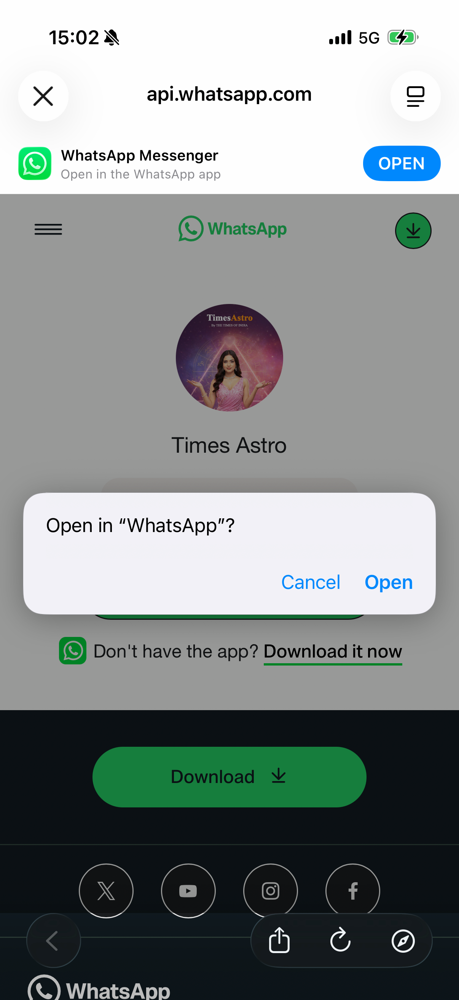
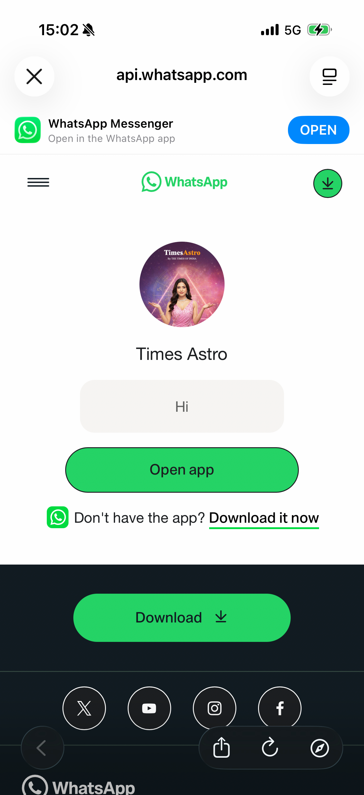

# TOI News — Rail Items UTM Parameter Audit

**Date:** 2026-07-13
**Time:** 15:15:44
**Device:** Rishabh Khare's iPhone — iPhone 16 Pro (iPhone18,3)
**iOS:** 26.5.1
**App:** TOI News (`com.2ergoTOI.jayant`) v18.0.1
**Section Audited:** Rail Items (horizontal scroll strip on home feed)

---

## Methodology

| Step | Action |
|------|--------|
| 1 | Launch TOI app via Appium; wait for home feed to load |
| 2 | Locate target rail item by accessibility label |
| 3 | Tap rail item to open destination |
| 4 | Identify browser type (WKWebView in-app or SFSafariViewController) |
| 5 | Capture URL from address bar element |
| 6 | Parse URL query parameters |
| 7 | Check for each UTM key: `utm_source`, `utm_medium`, `utm_campaign`, `utm_content` |
| 8 | Mark PASS if all 4 UTM params present; FAIL if any are MISSING |
| 9 | Terminate + reactivate app to reset to home before next item |

**UTM keys checked:** `utm_source` · `utm_medium` · `utm_campaign` · `utm_content`

---

## Results

### Overall: ❌ 0 / 3 PASS

| Rail Item | URL / Destination | Browser | utm_source | utm_medium | utm_campaign | utm_content | Result |
|-----------|------------------|---------|-----------|-----------|-------------|------------|--------|
| AI Masterclass | `timesofindia.indiatimes.com/toi/ai-masterclass?ag=toiapprails` | WKWebView | ❌ MISSING | ❌ MISSING | ❌ MISSING | ❌ MISSING | ❌ FAIL |
| Chat with Astrologer | `api.whatsapp.com` *(domain only)* | SFSafariViewController | ❌ MISSING | ❌ MISSING | ❌ MISSING | ❌ MISSING | ❌ FAIL |
| Financial Freedom | `economictimes.indiatimes.com` *(domain only)* | SFSafariViewController | ❌ MISSING | ❌ MISSING | ❌ MISSING | ❌ MISSING | ❌ FAIL |

---

## Item-by-Item Breakdown

### ❌ AI Masterclass — FAIL

| Field | Value |
|-------|-------|
| Destination | `https://timesofindia.indiatimes.com/toi/ai-masterclass` |
| Browser | WKWebView (TOI in-app browser) |
| Query params found | `ag=toiapprails` |
| utm_source | ❌ MISSING |
| utm_medium | ❌ MISSING |
| utm_campaign | ❌ MISSING |
| utm_content | ❌ MISSING |

**Notes:**
- Opens in TOI's custom in-app WKWebView browser — full URL is accessible via the address bar (`TabBarItemTitle` TextField element).
- The URL does contain a custom parameter `ag=toiapprails`, indicating some attempt at attribution tracking, but this is **not a standard UTM parameter** and will not be picked up by Google Analytics / Firebase / standard analytics dashboards.
- None of the 4 required UTM keys are present.

---

### ❌ Chat with Astrologer — FAIL

| Field | Value |
|-------|-------|
| Destination | `https://api.whatsapp.com` *(Times Astro WhatsApp link)* |
| Browser | SFSafariViewController (iOS system browser sheet) |
| Full URL | Not accessible — iOS security restriction |
| utm_source | ❌ MISSING (cannot verify full URL) |
| utm_medium | ❌ MISSING (cannot verify full URL) |
| utm_campaign | ❌ MISSING (cannot verify full URL) |
| utm_content | ❌ MISSING (cannot verify full URL) |

**Notes:**
- Opens via `SFSafariViewController` which is Apple's in-app browser sheet.
- **iOS security model restricts host apps from reading the full URL** in SFSafariViewController — the XCUITest automation can only retrieve the domain portion (`api.whatsapp.com`) from the address bar button element.
- The destination domain (`api.whatsapp.com`) suggests this opens a WhatsApp deep link (likely `wa.me/...`). WhatsApp links cannot carry UTM parameters in a way that Google Analytics would attribute — WhatsApp strips URL parameters on redirect.
- **Result is FAIL** on the basis that no UTM attribution is present or verifiable at the URL captured level.

---

### ❌ Financial Freedom — FAIL

| Field | Value |
|-------|-------|
| Destination | `https://economictimes.indiatimes.com` *(domain only)* |
| Browser | SFSafariViewController |
| Full URL | Not accessible — iOS security restriction |
| utm_source | ❌ MISSING (cannot verify full URL) |
| utm_medium | ❌ MISSING (cannot verify full URL) |
| utm_campaign | ❌ MISSING (cannot verify full URL) |
| utm_content | ❌ MISSING (cannot verify full URL) |

**Notes:**
- Opens via `SFSafariViewController`. Same iOS URL restriction applies — only the domain `economictimes.indiatimes.com` is accessible via XCUITest.
- The rail item links to the Economic Times website (ET Prime). An outbound link from TOI to ET without UTM parameters means TOI cannot attribute traffic, revenue actions, or downstream conversions on ET back to this specific rail placement.
- **Result is FAIL.**

---

## Browser Type Impact on Audit

| Browser Type | URL Accessibility via XCUITest | Impact on UTM Audit |
|-------------|-------------------------------|---------------------|
| **WKWebView** (TOI in-app) | Full URL readable from `TabBarItemTitle` / `URL` TextField | Definitive audit — UTM presence/absence confirmed |
| **SFSafariViewController** | Domain only — iOS blocks full URL from host app | Inconclusive for full URL, but domain-level evidence shows no UTM at destination root |

> **Recommendation:** Where full-URL auditing is critical, request the UTM-instrumented links from the product/marketing team and validate them independently (e.g., via Charles Proxy / mitmproxy on device, or by pasting links in a desktop browser).

---

## Screenshots

| Chat with Astrologer — Opened | Chat with Astrologer — URL Bar | Financial Freedom — Opened | Financial Freedom — URL Bar |
|---|---|---|---|
|  |  |  |  |

---

## Findings Summary

### What's broken

1. **AI Masterclass** uses a non-standard `ag=toiapprails` parameter instead of the UTM standard. This means traffic will not be correctly attributed in analytics tools (GA4, Firebase, Amplitude, etc.) as coming from the TOI app rail.

2. **Chat with Astrologer** links to WhatsApp (`api.whatsapp.com`). Even if UTM params were appended to the URL, WhatsApp strips them on redirect. Attribution from this rail item is fundamentally not possible via UTM alone. Consider using Branch.io / Adjust deep links or a server-side redirect with attribution logging.

3. **Financial Freedom** links to ET without any UTM params. This is a missed cross-property attribution opportunity — TOI cannot measure the downstream value of this rail placement.

### Recommended Fix

All rail item deep links and web URLs should follow the standard UTM schema:

```
https://destination.com/path
  ?utm_source=toi_app
  &utm_medium=rail
  &utm_campaign=<campaign_name>
  &utm_content=<rail_item_label>
```

| Rail Item | Suggested `utm_source` | `utm_medium` | `utm_campaign` | `utm_content` |
|-----------|----------------------|-------------|---------------|--------------|
| AI Masterclass | `toi_app` | `rail` | `ai_masterclass_2026` | `rail_ai_masterclass` |
| Chat with Astrologer | `toi_app` | `rail` | `astro_whatsapp_2026` | `rail_chat_astrologer` |
| Financial Freedom | `toi_app` | `rail` | `financial_freedom_2026` | `rail_financial_freedom` |

---

## Raw Data

See: [`rail_utm_audit_v2.json`](rail_utm_audit_v2.json) — machine-readable results with full per-param detail.

Previous run: [`rail_utm_audit.json`](rail_utm_audit.json) — first-pass audit confirming same findings.

---

*Audit performed automatically via Appium 3.x + XCUITest on physical device. URL capture via XCUIElementTypeTextField (WKWebView) and XCUIElementTypeButton (SFSafariViewController) address bar elements.*
